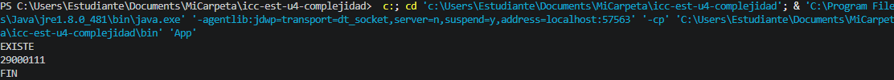

# Práctica: 04.01 Complejidad Proyecto JAVA

## Datos del Estudiante
- **Nombre:** Nicole Estefania Dominguez Muñoz
- **Curso:** Estructura de Datos G2
- **Fecha:** 14/03/2026

---

## 1. icc-est-u4-complejidad

**Fecha:** 14/034/26

**Descripción:** Creamos el proyeco y subimos a GitHub

---

## 2. icc-est-u4-complejidad

**Fecha:** 15/04/26

**Descripción:** creamos la clase estudiante y generados y creamos un listado de estudiantes con datos aleatorios para buscar y optim izar la busqueda. 

